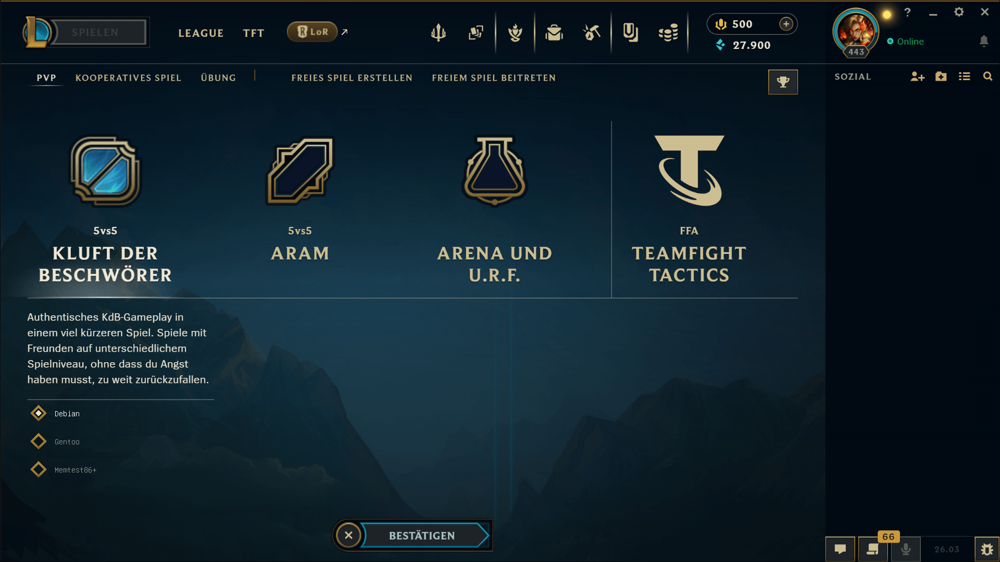

# League-of-Legends-grub-theme





# Installation

After installing this theme simply point grub towards the installed path in /etc/default/grub

```
GRUB_THEME=/boot/grub/theme/theme.txt 
GRUB_TERMINAL="gfxterm" # make sure you have gfxterm set as your grub terminal
```

generate configuration using:
```bash
grub-mkconfig -o /boot/grub/grub.cfg
```
and you should be good to go!


